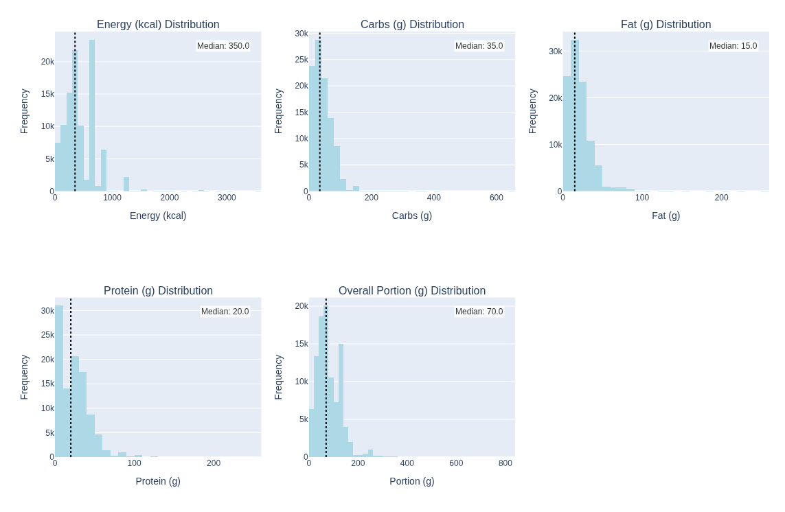
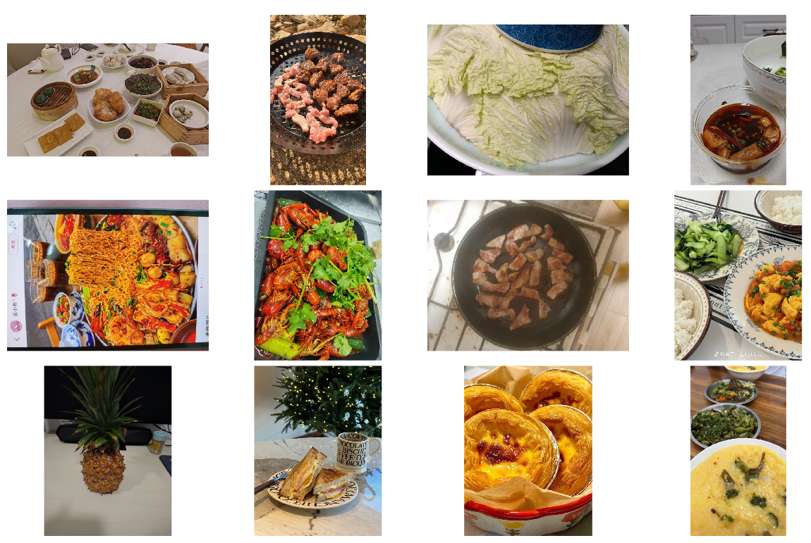
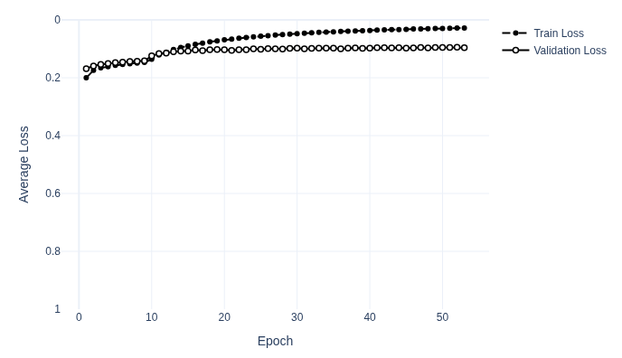
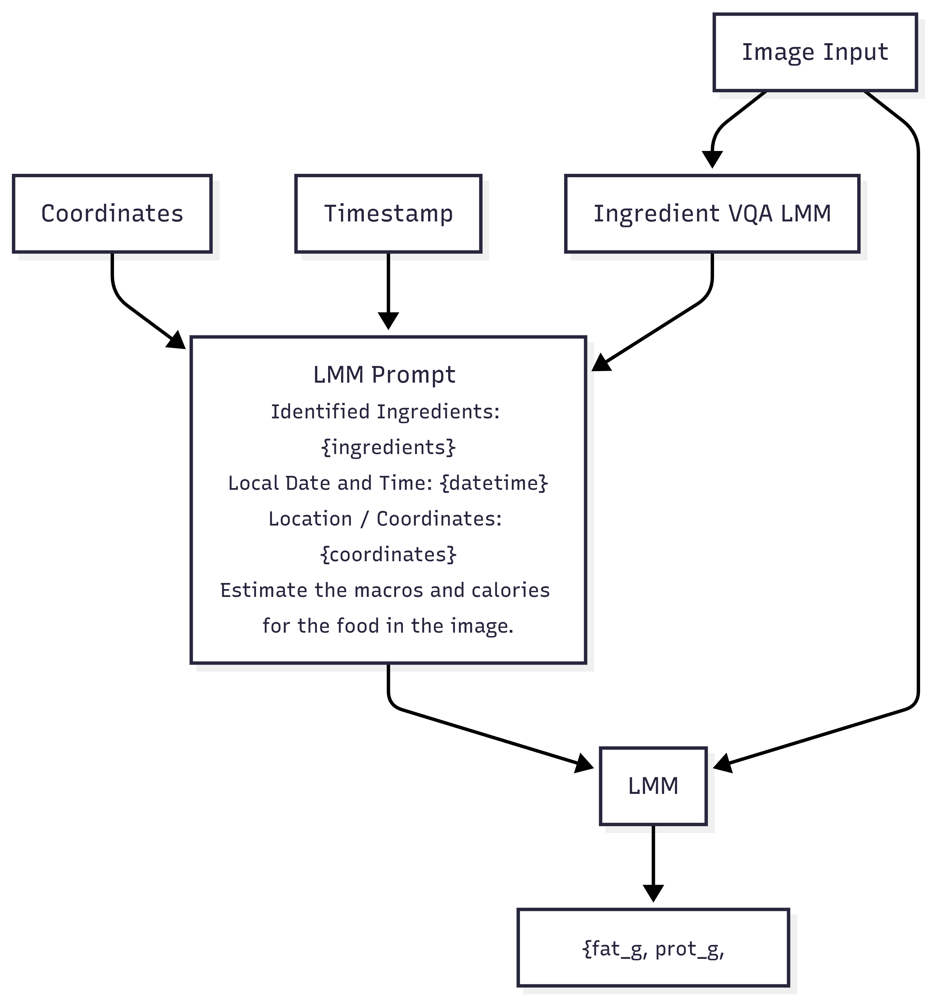

# BRAINSTORM

The researched on model architectures for this work was limited to an area of research involved in small and efficient architectures. @squeezenet studied how different filter dimensions affected network accuracy and 
efficiency among other things, they introduced _SqueezeNet_, a CNN with AlexNet level accuracy and 50x fewer parameters. They showcase three strategies to decrease the number of parameters in a network while preserving the most accuracy. 
The strategis showcased in @squeezenet are: First, replacing 3x3 filters with pointwise convolutions _"since a 1x1 filter has 9X fewer parameters than a 3x3 filter"_. Second, in order to shrink the parameter count further, decrease the number
of input channels or features that lead to 3x3 filters, as they highlight that the number of parameters in a layer are (number of input channels) * (number of filters) * (filter dimensions, eg: 3x3). Thirdly, downsampling late in the network as opposed 
to early, so that the final activation maps don't loose too much resolution and information is not lost, which according to @squeezenet is done mainly to preserve accuracy.

The parameter shrinking strategies showcased by @squeezenet led them to come up with the _Fire module_, of which SqueezeNet is mostly comprised of. A Fire module is made up of a _squeeze_ phase that uses 1x1 filters to shrink the depth of the output tensor depending on the number of 1x1 filters, 
and an _expand_ phase featuring 1x1 and 3x3 filters. So their fire module has three hyperparameters, the number of 1x1 filters in the squeeze, the number of 1x1 filters in the expand and the number of 3x3 filters in the expand phase. They note 
that in order to align with their second strategy, they keep the number of filters in the squeeze phase to be less than the sum of all the filters in the expand phase.

Later, @senetworks introduced the _Squeeze and Excitation_ (SE) block as a way to perform feature (channel) recalibration _"to selectively emphasise informative features and suppress less useful ones"_ @senetworks.

# Aim
The goal of this work is to systematically explore ways in which to predict the macronutrient mass (in grams) from food images. 
Macronutrient mass (grams of protein, fat and carbohydrate) were chosen as the three targets and they were used to calculate calories.
Predictions were made from 1) a single image and 2) no reference object for size in the image. These rules served to limit the scope of the project, 
to allow for the use of the same dataset, and to make a general solution that is suitable for real world applications. 

Achieving SOTA or close to SOTA quality presented a significant challenge. In order to accomplish this,
the project adopted an experimental and research driven approach, 
using the literature to justify decisions and hypotheses, and testing those hypotheses through experimentation,
thus adhering to the scientific method.

The source code for this project can be found at [https://github.com/LuckyToaster/end_of_degree_projec](https://github.com/LuckyToaster/end_of_degree_project)

# Introduction

The biggest challenge when it comes to using computer vision models to predict nutritional information from food images is that it is difficult to predict mass or volume from food images,
using a reference object in images may help models better learn this feature @food_portion_size_estimation. @food_portion_size_estimation reported low error in predicting volume from food images,
although useful in demonstrating how to create a nutrition dataset (one containing reference objects like coins), did not disclose how they obtained such results and simply called it 
'a computer algorithm'. Since no dataset containing images with reference objects annotated with nutritional information was found from an early stage, the present work shifted to make a general purpose solution that would hopefully
predict low enough errors that would beat human estimations.

# The Data

## Choosing a dataset
The dataset used was the **[MM-Food-100K Dataset](https://huggingface.co/datasets/Codatta/MM-Food-100K)** @mmfood100k, which contains ~100K labeled images of restaurant and home cooked food.
It was chosen because the images are labelled with nutrionional information needed for this work, for of its large size, 
and because of its diversity: featuring different dish sizes, cuisines, lighting, camera-quality ... etc.

Other researched datasets include ACEDATA @lmms_and_acedata, FooDD @foodd, Pittsburgh Fast Food Image Dataset @pittsburgh and Nutrition5K @nutrition5k. 
All of which, provided interesting insights into what makes a good dataset for the task in hand.

## Loading the data
The first step was to download the _MM-Food-100K Dataset_, to do this, 
a python script was made to download the dataset csv file and images concurrently and idempotently, 
meaning that upon each execution, the script would attempt to download any missing images, 
as it took many hours to download the whole 166 GB of images and it was unrealistic to expect the whole script to finish execution uninterrupted in one go.
To ensure maximum speed, the data loading script featured concurrency for networking tasks and parallelism for processing and disk access.

After having a local copy of the dataset, a custom pytorch Dataset class was made to allow obtaining the image and targets when iterating over it. 
That Dataset class would be passed to a DataLoader and then fed to the model.

Later during training, a bottleneck was found, it was caused by the heavy image transform computations from the DataLoader loading batches into the model.
The data loading script was modified to offload the image resizing computation to that data loading stage. 
After that improvement, batches were fed to the model during training at approximately twice the speed.

Finally, upon revisiting the code months later, it was evident that having almost two hundred gigabytes of images locally was not a good idea,
so the data loading script was refactored and improved one final time so that images would be downloaded and resized in memory and then saved to disk. 
This cut the dataset size into a fraction of what it was before and improved the speed of the script somewhat as it made less I/O operations.

## A Quick EDA

After loading the data, it was manually checked for coherence. 15 samples of the dataset were chosen and their calorie and macronutrient annotations were checked so that the calory and macronutrient annotations matched.
Many rows were also inspected to see the type of images present and the quality of the other annotations. Then, calorie and macronutrient histograms were plotted to see which targets hold more weight and if the distribution of 
the data in the dataset is representative of real data, at least at a glance, which is useful when training a model. Below is a sample of the MM-Food-100K dataset, and the corresponding histograms.

# Multi-ouput Regression
The computer vision task at hand requires multi output regression. 
A Neural Network can be adapted for regression by modifying the head of the network
and changing the criterion from Cross-Entropy loss to MSE (L2) or MAE (L1) Loss.

The literature on CNNs is very classification biased, as it is centered around benchmarking on ImageNet classification.
After reading much literature on CNN architectures, the question of whether any ImageNet pretrained classification CNN would work well for our regression task emerged.
@do_imagenet_models_transfer_better analysed how 16 model architectures perform when fine tuned, trained from scratch or used as feature extractors
for 12 different datasets. They found that:

- Imagenet accuracy is a good indicator of transfer accuracy
- On some small, fine grained datasets, the benefit of fine-tuning vs training from scratch is minimal.
- The benefits of ImageNet pretraining fade for larger datasets.
- ImageNet pretraining accelerates convergence.

With this information, it was decided to use transfer learning when training the model, because even if the MMFood100K dataset is too large or too 
different from ImageNet, it will converge faster saving a of training time.

**REDACT**
Sadly, @do_imagenet_models_transfer_better did not consider regression or predictions of continuous numerical values, 
and not much information was found on this topic besides some casual internet articles.

**REVISE**
How well Imagenet trained classification CNNs transfer to other tasks other than classification was not studied by [6]

## Model Architecture Evaluation
Before using transfer leaning to train a model to do multi-output regression, it was decided to make some empirical experiment to predict which
model architectore would perform better.

To find which pretrained model architecture would transfer better with out dataset, or in other words, which would be the most suitable
model for our data, a _"model shootout"_ study was devised. 

A study was made with the [Optuna](https://optuna.org/) library that would pick different pretrained models using grid sampling, train the models with the same hyperparameters, 
for a fixed number of epochs using feature extraction (frozen backbone, training only the head).

This was a cheap and fast way to make an educated guess to pick the model since _"when [different models are] used as fixed feature extractors ..., ImageNet top-1 accuracy was 
correlated with accuracy on transfer learning"_ @do_imagenet_models_transfer_better .

After runnign the _"model shootout"_ optuna study for four times, it was determined that out of the following models:

- EfficientNet_B3
- EfficientNet_V2_S
- MobileNet_V3_L
- Swin_V2_S

The Swin came on top being the fastest learner, which makes sense since all the others are CNNs and Swin is a more modern Vision Transformer.

The variant of each model was chosen as the biggest variant that could fit on a _16GB VRAM RTX 5060 ti_ GPU. 

## Sequential fine tuning with Hyperparameter Optimization

After the Swin model won the shootout, a two step training stage was ran in an extensive hyperparameter optimization study to find 
the best settings for the model and minimize the loss.

The sequential fine tuning consisted of a _warm up_ step before fine tuning, where head learns while the backbone is frozen.

The sequential fine tuning was ran in an extensive hyperparameter optimization study using the Optuna library, that optimized the following hyperparameters:

- Feature extraction phase learning rate
- Feature extraction weight decay
- Feature extraction epochs
- Fine tuning phase learning rate
- Fine tuning weight decay
- Fine tuning epochs
- Loss used (MAE, MSE or Huber) 

And the following hidden flat layer that was inserted before the head

- number of hidden units before the head (not a hyperparameter)
- hidden layer dropout 

| Nutrient | MAE (grams) | MAE (kcal) |
| :--- | :--- | :--- |
| Fat | 4.22 | 37.98 |
| Carbs | 9.68 | 38.72 |
| Protein | 4.8 | 19.2 |
| **Total** | - | **95.9** |

# LMM enriched with metadata

@lmms_and_acedata found that when feeding an image of food enriched with metadata 
like GPS coordinates, time of day and a list of ingredients to an LMM (Large Multimodal Model) at prompt time, 
while using prompting techniques like Chain of Thought, Scale Hint in the image, Few-shot and Expert Persona, 
the error in the predictions would shrink significantly. However, @lmms_and_acedata reported MAE too hight to make 
such a solution usable.

The LMM pipeline for estimating nutritional information in @lmms_and_acedata was replicated nonetheless, 
in order to compare the results with the fine tuned vision transformer (more details in Figure 1).

It consisted of the following components:

- An ingredient VQA (Visual Question Answering) LMM
- A coordinate fetching function
- A timestamp function
- A nutrition prediction LMM

{width=70%}

The ingredient VQA LMM was simply an LMM that is given a food images and outputs a list of detected food items or ingredients. The list of ingredients, location coordinates and timestamp are fed to the nutrition prediction LMM
at prompt time to make the final prediction. The `gemini-3.1-flash-lite` LMM was used for both LMMs throught Google's API. Since the food images in the dataset are not annotated with timestamps or with timestamps or classifications that
can be used to infer if the image is breakfast, lunch or dinner, the location and time information was not used to test the pipeline. Also, testing the pipeline on the hidden validation split would haved incurred thousands of API calls to gemini models, 
which could turn out to be expensive, so the evaluation of the pipeline was done with 100 samples of the hidden validation split. The results obtained were practically equivalent to those reported in @lmms_and_acedata, and can be seen below.

## LMM Pipeline Results
| Nutrient | MAE (grams) | MAE (kcal) |
| :--- | :--- | :--- |
| Fat | 12.47 | 121.23 |
| Carbs | 18.77 | 75.08 |
| Protein | 13.5 | 54 |
| **Total** | - | **250.31** |

** Keep?**
This experiment was carried out eagerly, while the optuna optuna study for fine tuning the model in the previous experiment was being executed, and before having obtained the results of the fine the before seeing the results of 

# Future Improvements

While the results of the fine tuned Swin model were not too unsatisfactory, there is much room for improvement. First, the model shootout experiment went terribly wrong and it should be fixed. 
Second, both optuna studies could have been ran for much longer to obtain better results. The results of one promising fine tuning study with over 50 completed trials was accidentally lost, and the second time that
the study was ran, the range of the number of epochs was modified mid study, which caused optuna perform suboptimally, yielding no better studies as it ran sampling the new search space. So it would have been ideal to have 
both hyperparemeter optimization experiments running properly and for much longer. Moreover, better results could be achieved theoretically by removing outliers from the dataset, 
and performing data augmentations like in @autoaugment and @randaugment. And finally, it is highly plausible that the studies for selecting a suitable architecture and fine tuning a model can be further improved.

Finally, more experiments could be carried out, perhaps by training more models on different targets, and investigating which combination can yield better results. Some future ideas could be:

- One model to predict each macronutrient mass
- One model to predict total mass and another to predict the distribution of the three macronutrients (although this does not address varying calorie densities of different foods)
- A pipeline like one described in @from_pixels_to_cals _"[A standard] Pipeline typically consists of food detection, classification, and portion estimation"_

These are important insights that should be addressed in future work which could yield surprising results.  

#  References

